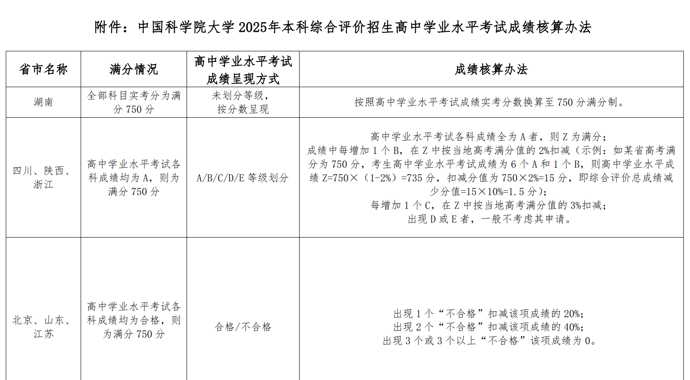

# 中国科学院大学

### 1. 官方网站

https://www.ucas.ac.cn/

### 2. 优势

- 中国科学院旗下
- 研究型，以硕士博士教育为主，以后保研容易
- 随便转专业，想学什么都可以，读2年再转都行。门槛是所有科目不能挂科，去年转专业成功率是100%，有个冷门专业转得只剩下3个人，这种教育理念非常好，以人为本
- 比清北低一档，不用跟别人去抢清北垃圾专业
- 有希望以后分数线超过清北，如果大家更注重专业的话

### 3. 劣势

- 本科生规模小
- 本科教育办学年限短
- 知名度略低，很多人只知道中国科技大学，还将中国科学院大学调侃为“院大”
- 本科在雁栖湖校区，不在中关村

### 4. 招生简章

2025年本科招生增加了天津，以前没考查就是因为他不在天津招生

https://gaokao.chsi.com.cn/zzbm/xxgk/detailXx.action?xxId=8edb6d4t1bfpl28q

重点是这个学校在 ** 提前批 **

### 5. 时间安排

- 报名 2025年4月30日16:00至5月15日24:00
- 面试1小时，也叫综合评价，一般为高考之后，高考成绩公布之前
  面试将主要考察学生的数理基础、逻辑推理、学习兴趣、想象能力、表达能力等综合素质，一般不出具刚性答案的题目。

时间安排完全不影响高考

### 6. 招生标准

- 高中竞赛和科研，虽然报名时有提交证书的地方，但是据说没啥作用，还是看高考成绩
- 高考成绩占60%
- 面试成绩占30%，据说分数差距很小，只有1-2分，主要看高考成绩
- 学业水平考试成绩占10%，B/C/D/E类都会拉分，全 A 才满分，详情见下图，各省不一样，天津市的标准应该很快可以查到
- 面试里有个体育，立定跳远、仰卧起坐、跳绳三选一，其实就是走过场，看看身体是否健康，完全没门槛
- 北京的录取位次大约在600-800，紧随清北

