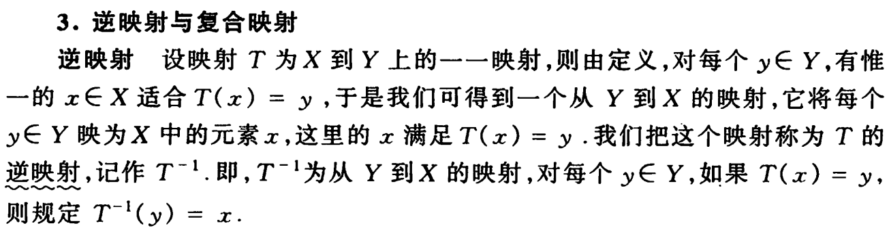
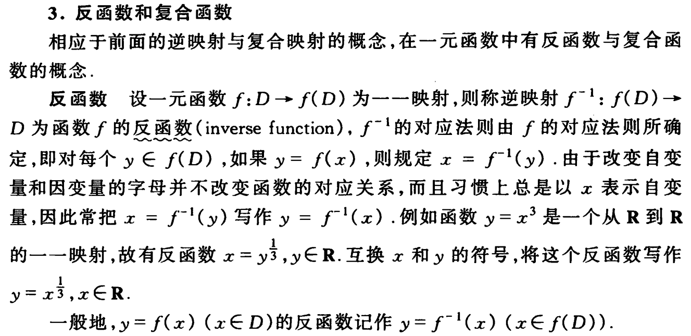
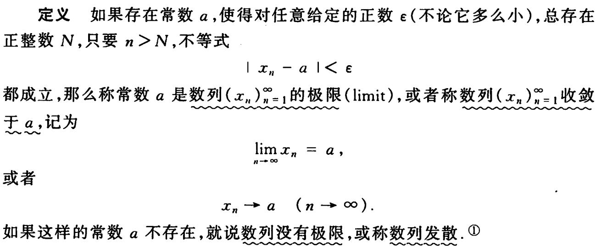

# 大学应该怎么学

### 自我管理

没人管你了

上课前老师不认识，下课后老师找不到。

负责任的老师上课点个名，不负责的老师直接把课本读下来

负责任的老师把知识点前因后果脉络给你讲清楚了，不负责的自己都没弄明白

布置作业一下子布置一周的，你拖到了下周要上课了，再着急已经来不及了

想打游戏就打游戏，想刷视频就刷视频，家长也管不着了

想谈恋爱就谈恋爱，想跟谁谈就跟谁谈

大学里，自我管理，自己驱动自己的能力就非常重要了，以前的被动学习，现在要改为主动学习

### 读研是必须的

几十年前，读了大学就能就业。 现在高等教育普及，想要好的就业，硕士学历是必须的

没有目标，按部就班走下来的话，大概率也是个按部就班的结果

### 考研？保研？

考研是痛苦的，跟高考一样，千军万马过独木桥，不得不面对不喜欢的科目

跟高考不一样的是，保研的几率非常大，所以学习成绩也就是绩点就非常重要。 同时千万不能挂科，挂科直接失去保研资格

让绩点优异的方法只有一个，那就是投入时间学明白。 

### 投入时间学明白

### 投入时间学明白

### 投入时间学明白

### 不挂科的方法，都是旁门左道，学了的人后果自负

- 临时抱佛脚，找老师画重点，突击复习两周
- 背课后作业题
- 找学长要一份上届上上届的考题刷一下，研读这个老师的考试原题，很多老师真的是懒得再出一套题，即使新出，老题掌握了也足够你及格
- 跟老师混熟了找老师通融一下，还有行贿老师的

### 有难度的理论科目：提前自学，复习和预习，笔记

大学生所学课程的知识容量和难度远远高于高中，同时学习的努力程度远远不及高中

高校的课程，尤其是理科课程，难度上升，概念多，进度很快，老师不管，最重要的是抽象，教的东西以前都没见过，教材还写的干巴巴的，一上来直接就给个数学符号描述的定义

面对这些难题，我的建议是一定要进行预习和复习，或者找本通俗易懂的教材提前看一遍，或者找网上视频跟着先遛一遍

高考后，马上自学高等数学，至少学完第一册第一册

课后复习，背熟，题海战术，大一大二做好考试

看看高等数学第一节课要学的内容，脑袋瓜是不是嗡嗡的。

##### 映射

##### 函数

##### 极限

中学引入了字母代替数字

高等数学引入了数学符号语言，用符号精确表述，好多数学家用法还不一样有点乱

### 跟老师关系好

保研考研跟高考不一样的是，高考只看分数。保研除了绩点，如果跟老师关系好，可以挑一个喜欢的有前途的导师和方向

要注意的是也有导师很坑，这就要看自己对他的了解程度了，从学姐师兄那里了解是个好途径

跟老师熟悉了，哪怕你能力老师看不上，你有听话、办事靠得住、努力的态度和行动，这些都可以打动老师

### 积极参加竞赛

计算机有ACM和蓝桥杯。在实战中最锻炼人。这是面向就业最好的训练，不过升学深造更看重理论。

### 积极参与科研

大二大三就 死皮赖脸的抱着硕士生导师要做课题，发论文。找老师，找学长请教，脸皮要厚，不要不好意思，你满足了他好为人师的心理

### 积极参与组织活动

递交入党申请书

暑假投机，参加各种下乡支教社会活动，展现自己是个有社会责任的人

### 想深造，学好英语

雅思托福成绩有利于保研、出国，甚至不用再修英语，能省很多时间

### 发展自己的兴趣

找到自己感兴趣的方向，投入时间和精力去玩，比如找个竞赛项目，找个科研项目，钻进去，很容易就有收获

参加过竞赛和科研、或者真正的项目的孩子，思考深度、动手能力是聊几句就很容易看出来的

### 培养自己的特长

培养一个能用来吃饭的本事

一招鲜吃遍天，吃一辈子是不可能的，吃几年还是不成问题的

