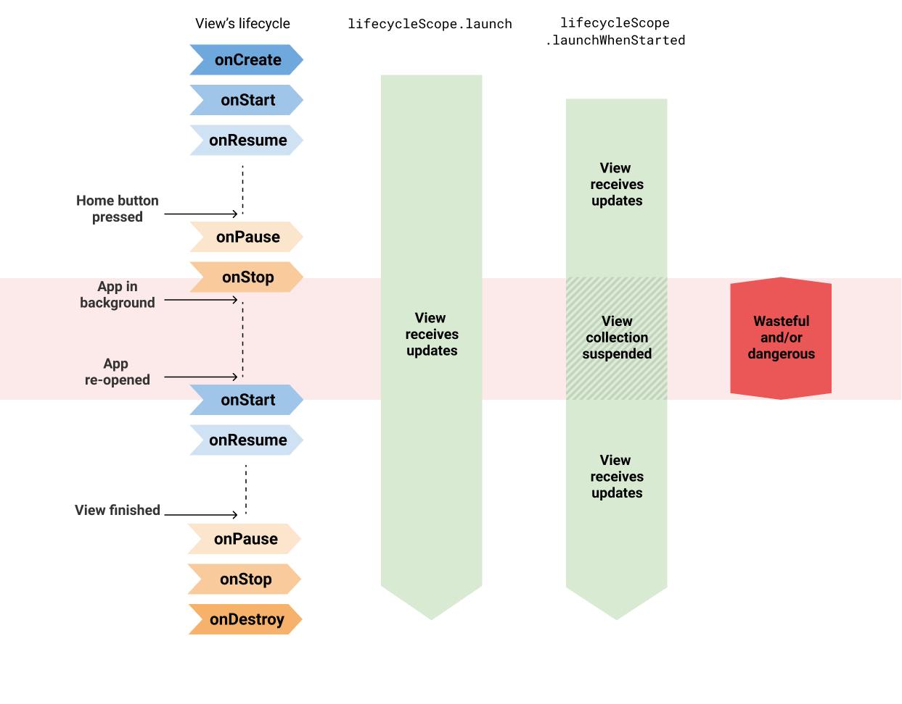
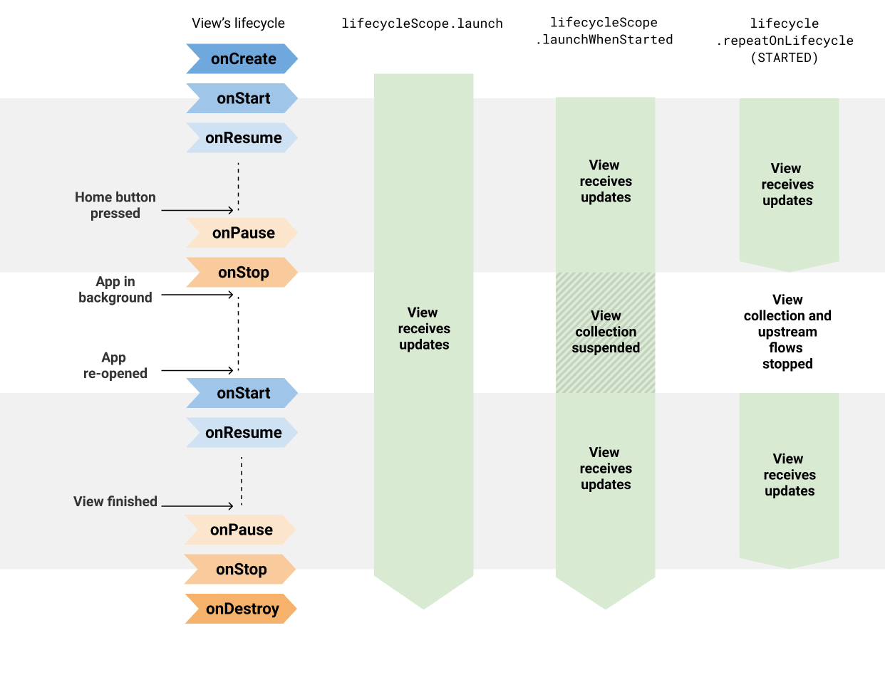
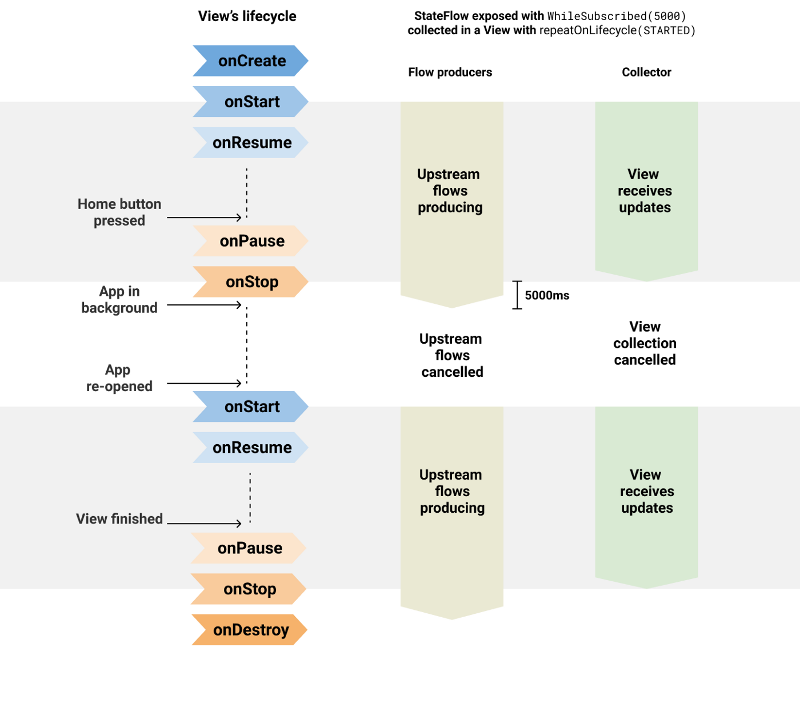

# 从 LiveData 迁移到 Kotlin 流

### 原文 [Migrating from LiveData to Kotlin’s Flow](https://medium.com/androiddevelopers/migrating-from-livedata-to-kotlins-flow-379292f419fb)


2017年的时候，我们需要 LiveData。观察者模式让我们生活更轻松，但 RxJava 等方案对于初学者来说过于复杂，架构组件团队就专门为 Android 平台创建了 LiveData，一个能感知组件生命周期的、可观察的数据持有类。它简单易上手，RxJava 适用于更复杂的响应式流，两者组合使用效果更佳。

## DeadData?
LiveData 解决方案仍然适用于 Java 开发人员、初学者和简单场景。其他情况下，建议迁移到 Kotlin Flows。Flows 是 Kotlin语言的一部分，学习曲线比较陡，由 Jetbrains 维护。未来的 Compose 更适合响应式模型。

我们已经谈到了 Flows 在应用内各部分的使用，除了 view 和 ViewModel。现在我们有更安全的方式从界面收集数据流，我们就创建了这个迁移向导。

本文将学习如何在接受流式数据、显示流式数据，以及根据需求进行微调。

## Flow：简单的事情更难，复杂的事情更容易
LiveData 只作一件事情也做的很好：拿到新数据的时候暴露数据，并且理解 Android 组件的生命周期。也能启动协程，并作复杂的数据转换，但是有点复杂了。

我们来看看 LiveData 模式实现 和等价的 Flow 实现

### #1：暴露一次性操作的结果，使用可变数据持有者


```kotlin
class MyViewModel {
    private val _myUiState = MutableStateFlow<Result<UiState>>(Result.Loading)
    val myUiState: StateFlow<Result<UiState>> = _myUiState

    // Load data from a suspend fun and mutate state
    init {
        viewModelScope.launch { 
            val result = ...
            _myUiState.value = result
        }
    }
}
```

StateFlow 是一个特殊的 SharedFlow（特定类型Flow），与 LiveData 很接近
- 永远都有值
- 永远只有1个值
- 支持多个观察者（因为它是SharedFlow的子类）
- 订阅时总是会回放最新的那个值，不管有多少个订阅者

> StateFlow 特别适合用来保存界面状态

### #2：暴露一次性操作的结果，使用不可变数据持有者

```kotlin
class MyViewModel(...) : ViewModel() {
    val result: StateFlow<Result<UiState>> = flow {
        emit(repository.fetchItem())
    }.stateIn(
        scope = viewModelScope, 
        started = WhileSubscribed(5000), // Or Lazily because it's a one-shot
        initialValue = Result.Loading
    )
}
```
stateIn 操作能将 Flow 转换为 StateFlow。

### #3：带参数的一次性数据加载

```kotlin
class MyViewModel(authManager..., repository...) : ViewModel() {
    private val userId: Flow<UserId> = authManager.observeUser().map { user -> user.id }

    val result: StateFlow<Result<Item>> = userId.mapLatest { newUserId ->
        repository.fetchItem(newUserId)
    }.stateIn(
        scope = viewModelScope, 
        started = WhileSubscribed(5000), 
        initialValue = Result.Loading
    )
}
```
> 注意：如果需要更大的灵活性，也可以使用 transformLatest 并显式发射数据项
```kotlin
    val result = userId.transformLatest { newUserId ->
        emit(Result.LoadingData)
        emit(repository.fetchItem(newUserId))
    }.stateIn(
        scope = viewModelScope, 
        started = WhileSubscribed(5000), 
        initialValue = Result.LoadingUser // Note the different Loading states
    )
```
### #4：带参数观察数据流

```kotlin
class MyViewModel(authManager..., repository...) : ViewModel() {
    private val userId: Flow<String?> = 
        authManager.observeUser().map { user -> user?.id }

    val result: StateFlow<Result<Item>> = userId.flatMapLatest { newUserId ->
        repository.observeItem(newUserId)
    }.stateIn(
        scope = viewModelScope, 
        started = WhileSubscribed(5000), 
        initialValue = Result.LoadingUser
    )
}
```
不管是 user 变了，还是 user 的数据改了，暴露的 StateFlow 都会收到更新。

### #5：组合多数据源：MediatorLiveData -> Flow.combine
```kotlin
val flow1: Flow<Int> = ...
val flow2: Flow<Int> = ...

val result = combine(flow1, flow2) { a, b -> a + b }
```
也可以使用 combineTransform 方法，或者 zip

## 配置暴露的 StateFlow（使用 stateIn 操作符）
前面我们使用 stateIn 将常规的 flow 转为 StateFlow，这需要一些配置。如果你想直接用，可以拷贝下面代码
```kotlin
val result: StateFlow<Result<UiState>> = someFlow
    .stateIn(
        scope = viewModelScope, 
        started = WhileSubscribed(5000), 
        initialValue = Result.Loading
    )
```
如果你不确定这个看似随机5秒的 started 参数，我们继续看。

stateIn 有3个参数
> scope 携程上下文，共享在里面开始

> started 共享开始和结束的控制策略，有3个值
- Lazily：第一个订阅者出现时开始，协程上下文结束时取消
- Eagerly：立即开始
- WhileSubscribed：比较复杂

> initialValue StateFlow的初始值

一次性操作可以使用 Lazily 和 Eagerly。 但是想观察其他种类的流，应该使用 WhileSubscribed 并做一下小优化。

## WhileSubscribed 策略
没有收集器的时候，WhileSubscribed 会取消上游流。使用 stateIn 创建 StateFlow 暴露数据给视图，它也是从观察上游。上游一直保持活动状态会浪费资源，例如从数据库持续读取数据，或者从硬件传感器一直读取数据等。当应用到后台后，你应该做个好市民停止这些协程。

WhileSubscribed 带两个参数：
```kotlin
public fun WhileSubscribed(
    stopTimeoutMillis: Long = 0,
    replayExpirationMillis: Long = Long.MAX_VALUE
)
```
> stopTimeoutMillis 配置一个延时毫秒，最后一个订阅者消失与停止上游流之间的延时，默认是0，立即停止
这个机制很有用，如果试图停止侦听不到1秒，不用取消上游流。比如用户旋转设备时，视图被销毁并快速重新创建。

liveData 协程构建器，解决这个问题的方案是，协程没有订阅者后延迟5秒才停止。WhileSubscribed(5000) 也是做这个事情。

```kotlin
class MyViewModel(...) : ViewModel() {
    val result = userId.mapLatest { newUserId ->
        repository.observeItem(newUserId)
    }.stateIn(
        scope = viewModelScope, 
        started = WhileSubscribed(5000), 
        initialValue = Result.Loading
    )
}
```
这种方法搞定下面所有

- 当用户让app退到后台，5秒后，其他部件的数据更新就停止了，节省耗电
- 最后的数据会被缓存，当用户把app打开到前台，界面会立即拿到数据
- 重新订阅并会拿到新数据，需要的时候会刷新屏幕

## Replay expiration
如果你不想让用户看到太陈旧的数据，更愿意让用户看加载动画，可以关注replayExpirationMillis参数。这种情况下他非常方便，并且还节省了一些内存。回到应用程序不会那么快，但不会显示旧数据。

> replayExpirationMillis 配置一个延时（毫秒）...TODO...

## 视图观察StateFlow
为了收集流，需要一个协程。Activity 和 Fragment 都提供一组协程构建器：
- Activity.lifecycleScope.launch 立即开始，activity销毁时取消
- Frament.lifecycleScope.launch 立即开始，fragment销毁时取消
- Frament.viewLifecycleOwner.lifecycleScope.launch 立即开始，fragment上的视图销毁时取消。如果你修改界面，应该使用视图的生命周期。

## launchWhenStarted，launchWhenResumed...
这些特殊生命周期的 launchWhenX 版本，会等待 lifecycleOwner 到这个状态，并且在退出这个状态时挂起这个协程。
> 注意：哪怕是 lifecycleOwner 已经销毁了，它们都不会取消。
> launch/launchWhenX 是不安全的



app 在后台更新界面可能会导致崩溃，可以在界面上挂起收集器来解决这个问题。但是 app 在后台时，上游的流保持活动会浪费资源。

这意味着上面我们配置 StateFlow 所作的工作没啥用啊，没事，有新的 API 来解决这个问题。

## lifecycle.repeatOnLifecycle 方案
lifecycle-runtime-ktx 2.4.0 引入了这个新的协程构建器，就是我们需要的：它在指定状态下开始协程，并在状态退出后停止协程



例如：
```kotlin
onCreateView(...) {
    viewLifecycleOwner.lifecycleScope.launch {
        viewLifecycleOwner.lifecycle.repeatOnLifecycle(STARTED) {
            myViewModel.myUiState.collect { ... }
        }
    }
}
```
上面代码会在 Fragment 状态为 STARTED 时开始收集，RESUMED 时继续，STOPPED 时停止。

混合使用 repeatOnLifecycle 和 StateFlow 可以充分利用设备资源，同时获得最佳性能。



> 警告：StateFlow 也可以进行 Data Binding，它使用 launchWhenStarted 来收集更新，

## 总结

从 ViewModel 暴露数据和并从 View 层收集数据最好的方式是：
- 暴露一个 StateFlow，使用 WhileSubscribed 策略，设置一个5秒超时。
- 使用 repeatOnLifecycle 收集。

下面组合会保持上游活动状态，浪费资源：
- 使用 WhileSubscribed 策略暴露数据 并用 lifecycleScope.launch / launchWhenX 收集数据
- 使用 Lazily / Eagerly 策略暴露数据，并用 repeatOnLifecycle 收集数据

当然，如果你不需要强大的 Flow，也可以选用 LiveData。


