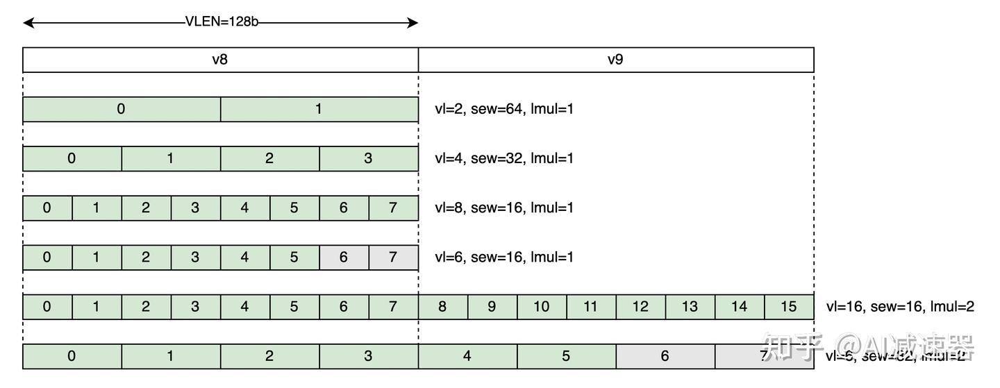

# RVV

### Vector Context Status

 mstatus[10:9]
- 00
- 01
- 10
- 11

Vector CSR
vlenb
vtype
vl
vcsr
vxrm
vxsat
vstart
VLEN
ELEN

https://zhuanlan.zhihu.com/p/9110931746

- `ELEN` 向量元素的最大位宽，2的次方，最小8
- `VLEN` 每个向量寄存器的位宽，2的次方，大于 `ELEN`
    cpu design设计完就定死了的，8 < ELEN < VLEN
    VLEN = 硬件寄存器的实际物理长度（以位为单位）
    vlenb = VLEN / 8
- SEW 当前要算的向量元素位宽
    配置到vtype寄存器里
- LMUL 组乘系数 把多个vector寄存器打包成一个group。取值是1/8，1/4，1/2，1，2，4，8。
    配置到vtype寄存器里
- VLMAX 每条指令可操作的最大elements个数。
    vl <= VLMAX
    VLMAX = LMUL * VLEN / SEW
- vl 本次指令要操作的element个数
- vstart 本次指令操作的起始element序号。

## vtype

- vlmul[2:0] 定义向量寄存器组的逻辑长度（寄存器组合并大小，1x、2x、4x 等）。
- vsew [5:3] 指定矢量数据的每个元素宽度。
- vta  [6:6] 定义计算结果中是否忽略尾部元素
- vma  [7:7] 表示是否忽略屏蔽位
- vill [XLEN-1] 最后1位，是否设置了非法值

- sew Seleted Element Width，代表指令要操作的元素的宽度，如8/16/32/64等
- lmul：Length Multiplier，允许跨几个寄存器访问元素
- vl：Vector Length，代表指令要操作的元素的个数 （这个是元素的个数，不是bit，不要和VLEN混了）, 注意vl指定的元素个数不一定要填满寄存器，可以留有尾巴不处理（tail，如下图灰色部分）

### 指令

vsetvli rd, rs, eN,mX,tP,mP

- rd：目标寄存器
- rs：源寄存器，存储着vl的值（如8/16/32/64）
- eN：代表sew，取值为e8/e16/e32/e64..
- mX: 代表lmul，取值为m1/m2/m4/m8..
- tP: tail policy，对于tail的处理策略，tu: tail元素内容保持不变，ta: tail元素内容保持不变或设置成全1
- mP: mask policy，对于被mask的元素处理策略，mu: 被mask掉的元素内容保持不变，ma：被mask掉的元素内容保持不变或设置成全1

举例, 如下指令设置vl=32，sew=32，lmul=1:

li      s5, 32
vsetvli t0, s5, e32, m1, ta, ma

# 文档翻译

#### 3.4.2. Vector Register Grouping (vlmul[2:0])

Multiple vector registers can be grouped together, so that a single vector instruction can operate on multiple vector registers. The term vector register group is used herein to refer to one or more vector registers used as a single operand to a vector instruction. Vector register groups can be used to provide greater execution efciency for longer application vectors, but the main reason for their inclusion is to allow double-width or larger elements to be operated on with the same vector length as single-width elements. The vector length multiplier, LMUL, when greater than 1, represents the default number of vector registers that are combined to form a vector register group. Implementations must support LMUL integer values of 1, 2, 4, and 8.

多个向量寄存器可以组合在一起，使得一条向量指令能够同时作用于多个向量寄存器。本文中使用**向量寄存器组（vector register group）**这一术语，指作为单个操作数被向量指令使用的一个或多个向量寄存器。向量寄存器组可用于在处理较长的应用向量时提高执行效率，但引入它们的主要原因，是为了能够在与单倍宽度元素相同的向量长度下，对双倍宽度或更大宽度的元素进行操作。当向量长度倍率 LMUL 大于 1 时，它表示组合成一个向量寄存器组的默认向量寄存器数量。实现必须支持 LMUL 取整数值 1、2、4 和 8。

Note:
The vector architecture includes instructions that take multiple source and destination vector operands with different element widths, but the same number of elements. The effective LMUL (EMUL) of each vector operand is determined by the number of registers required to hold the elements. For example, for a widening add operation, such as add 32-bit values to produce 64-bit results, a double-width result requires twice the LMUL of the single-width inputs.

注意：
向量体系结构中包含一些指令，它们可以接收具有不同元素宽度、但元素个数相同的多个源和目标向量操作数。每个向量操作数的有效 LMUL（EMUL）由存放这些元素所需的寄存器数量决定。例如，对于加宽加法操作（如对 32 位值相加并产生 64 位结果），双倍宽度的结果需要的 LMUL 是单倍宽度输入的两倍。

LMUL 也可以是分数值，用于减少单个向量寄存器中使用的位数。分数 LMUL 用于在处理混合宽度数据时，增加可有效使用的向量寄存器组数量。

注释
向量架构包括一些指令，这些指令可以处理多个具有不同元素宽度但相同元素数量的源和目标向量操作数。每个向量操作数的有效LMUL（EMUL）由存储元素所需的寄存器数量决定。例如，对于扩展加法操作（如将32位值加到一起以生成64位结果），双宽结果需要的LMUL是单宽输入的两倍。

LMUL can also be a fractional value, reducing the number of bits used in a single vector register. Fractional LMUL is used to
increase the number of effective usable vector register groups when operating on mixed-width values.

LMUL也可以是分数值，这会减少单个向量寄存器中使用的比特数。分数LMUL用于在处理混合宽度值时增加有效可用的向量寄存器组数量。

Note:
With only integer LMUL values, a loop operating on a range of sizes would have to allocate at least one whole vector register (LMUL=1) for the narrowest data type and then would consume multiple vector registers (LMUL>1) to form a vector register group for each wider vector operand. This can limit the number of vector register groups available. With fractional LMUL, the widest values need occupy only a single vector register while narrower values can occupy a fraction of a single vector register, allowing all 32 architectural vector register names to be used for different values in a vector loop even when handling mixed-width values. Fractional LMUL implies portions of vector registers are unused, but in some cases, having more shorter register-resident vectors improves efciency relative to fewer longer register-resident vectors.

注释
只有整数LMUL值时，处理不同大小范围的循环需要至少为最窄的数据类型分配一个完整的向量寄存器（LMUL=1），然后为每个更宽的向量操作数消耗多个向量寄存器（LMUL>1）以形成一个向量寄存器组。这可能会限制可用的向量寄存器组数量。使用分数LMUL时，最宽的值只需占用一个向量寄存器，而较窄的值可以占用单个向量寄存器的一部分，这使得即使在处理混合宽度值时，向量循环中也能使用所有32个架构向量寄存器名称。分数LMUL意味着向量寄存器的某些部分未使用，但在某些情况下，使用更多较短的寄存器驻留向量相对于使用更少的较长寄存器驻留向量可以提高效率。

Implementations must provide fractional LMUL settings that allow the narrowest supported type to occupy a fraction of a vector register corresponding to the ratio of the narrowest supported type’s width to that of the largest supported type’s width. In general, the requirement is to support LMUL ≥ SEWMIN/ELEN, where SEWMIN is the narrowest supported SEW value and ELEN is the widest supported SEW value. In the standard extensions, SEWMIN=8. For standard vector extensions with ELEN=32, fractional LMULs of 1/2 and 1/4 must be supported. For standard vector extensions with ELEN=64, fractional LMULs of 1/2, 1/4, and 1/8 must be supported.

实现必须提供分数LMUL设置，允许最窄支持类型占用一个向量寄存器的一部分，该部分的大小与最窄支持类型的宽度与最大支持类型宽度的比例相对应。通常，要求支持LMUL ≥ SEWMIN/ELEN，其中SEWMIN是最窄支持的SEW值，ELEN是最宽支持的SEW值。在标准扩展中，SEWMIN=8。对于标准向量扩展，若ELEN=32，则必须支持1/2和1/4的分数LMUL；对于ELEN=64的标准向量扩展，则必须支持1/2、1/4和1/8的分数LMUL。